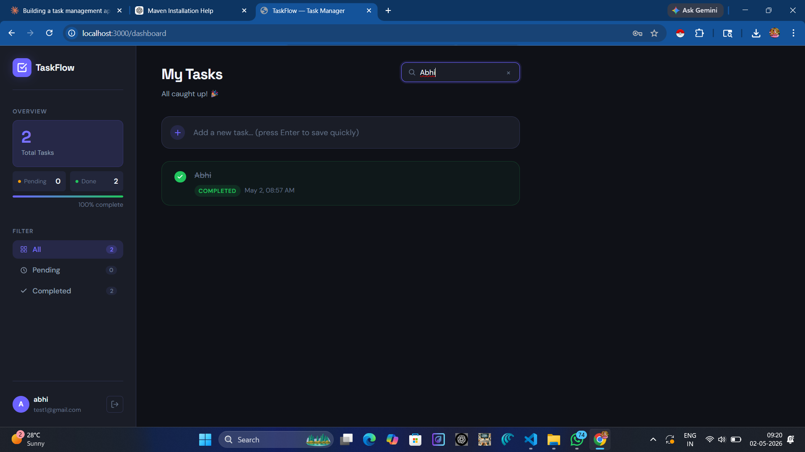

# TaskFlow — Task Management Application

A production-quality full-stack **Task Management Application** built with **Spring Boot + MySQL** (backend) and **React** (frontend), featuring JWT authentication, full CRUD operations, and a modern dark-themed UI.

---

## 📸 Screenshots

> Add screenshots here after running the project:
> - `/screenshots/login.png`
> - `/screenshots/dashboard.png`

> - `/screenshots/task-edit.png`

---

## 🧱 Tech Stack

### Backend
| Technology | Purpose |
|---|---|
| Java 17 | Language |
| Spring Boot 3.2 | Web framework |
| Spring Security | Authentication + authorization |
| Spring Data JPA | ORM / database layer |
| Hibernate | JPA implementation |
| MySQL 8 | Relational database |
| JWT (jjwt 0.12) | Stateless token auth |
| Lombok | Boilerplate reduction |
| Maven | Build tool |

### Frontend
| Technology | Purpose |
|---|---|
| React 18 | UI framework |
| React Router v6 | Client-side routing |
| Axios | HTTP client |
| react-hot-toast | Toast notifications |
| Vite | Build tool / dev server |
| CSS Modules | Scoped component styles |

---

## 📁 Project Structure

```
taskmanager/
├── backend/                         # Spring Boot application
│   ├── pom.xml
│   └── src/main/java/com/example/taskmanager/
│       ├── TaskManagerApplication.java
│       ├── config/
│       │   ├── SecurityConfig.java      # JWT + CORS config
│       │   └── DataInitializer.java     # Seeds default user
│       ├── controller/
│       │   ├── AuthController.java
│       │   └── TaskController.java
│       ├── service/
│       │   ├── AuthService.java
│       │   └── TaskService.java
│       ├── repository/
│       │   ├── UserRepository.java
│       │   └── TaskRepository.java
│       ├── model/
│       │   ├── User.java
│       │   ├── Task.java
│       │   └── TaskStatus.java
│       ├── dto/
│       │   ├── AuthDto.java
│       │   ├── TaskDto.java
│       │   └── ApiResponse.java
│       ├── security/
│       │   ├── JwtUtils.java
│       │   ├── JwtAuthenticationFilter.java
│       │   └── CustomUserDetailsService.java
│       └── exception/
│           ├── ResourceNotFoundException.java
│           └── GlobalExceptionHandler.java
│
├── frontend/                        # React application
│   ├── index.html
│   ├── vite.config.js
│   ├── package.json
│   └── src/
│       ├── main.jsx
│       ├── App.jsx
│       ├── api/
│       │   └── index.js              # Axios instance + API methods
│       ├── hooks/
│       │   ├── useAuth.jsx           # AuthContext + hook
│       │   └── useTasks.js           # Task state + operations
│       ├── components/
│       │   ├── auth/
|       |   |   |__ RegisterPage.jsx
|       |   |   |
│       │   │   ├── LoginPage.jsx
│       │   │   └── LoginPage.module.css
│       │   ├── tasks/
│       │   │   ├── DashboardPage.jsx
│       │   │   ├── DashboardPage.module.css
│       │   │   ├── TaskCard.jsx
│       │   │   ├── TaskCard.module.css
│       │   │   ├── TaskForm.jsx
│       │   │   └── TaskForm.module.css
│       │   └── common/
│       │       ├── ProtectedRoute.jsx
│       │       └── Spinner.jsx
│       └── styles/
│           └── global.css
│
├── database-setup.sql
└── README.md
```

---

## ⚙️ Prerequisites

- Java 17+
- Maven 3.8+
- Node.js 18+
- MySQL 8+

---

## 🗄️ MySQL Configuration

### Option A — Auto setup (recommended)
Spring Boot will automatically create the database and tables via JPA.  
Just ensure MySQL is running and update `application.properties`:

```properties
spring.datasource.url=jdbc:mysql://localhost:3306/task_manager_db?createDatabaseIfNotExist=true
spring.datasource.username=YOUR_MYSQL_USERNAME
spring.datasource.password=YOUR_MYSQL_PASSWORD
```

### Option B — Manual SQL setup
```bash
mysql -u root -p < database-setup.sql
```

---

## 🚀 Running the Backend

```bash
cd backend

# Option 1: Maven wrapper
./mvnw spring-boot:run

# Option 2: Build JAR then run
./mvnw clean package -DskipTests
java -jar target/taskmanager-1.0.0.jar
```

The backend starts on **http://localhost:8080**

> ✅ On first run, a default user is auto-seeded:
> - **Username:** `admin`
> - **Password:** `admin123`

---

## 🎨 Running the Frontend

```bash
cd frontend

# Install dependencies
npm install

# Start dev server
npm run dev
```

The frontend runs on **http://localhost:3000**

---

## 🔌 API Endpoints

### Authentication

| Method | URL | Description | Auth Required |
|--------|-----|-------------|---------------|
| POST | `/api/auth/login` | Login and receive JWT token | ❌ |

**Login Request:**
```json
{
  "username": "admin",
  "password": "admin123"
}
```

**Login Response:**
```json
{
  "success": true,
  "message": "Login successful",
  "data": {
    "token": "eyJhbGciOiJIUzI1NiJ9...",
    "username": "admin",
    "email": "admin@taskmanager.com",
    "message": "Login successful"
  }
}
```

---

### Tasks

All task endpoints require: `Authorization: Bearer <token>`

| Method | URL | Description |
|--------|-----|-------------|
| GET | `/api/tasks` | Get all tasks for current user |
| POST | `/api/tasks` | Create new task |
| PUT | `/api/tasks/{id}` | Update task fields |
| PATCH | `/api/tasks/{id}/toggle` | Toggle PENDING ↔ COMPLETED |
| DELETE | `/api/tasks/{id}` | Delete task |

**Create Task Request:**
```json
{
  "title": "Write unit tests",
  "description": "Cover all service layer methods"
}
```

**Task Response:**
```json
{
  "success": true,
  "message": "Task created successfully",
  "data": {
    "id": 1,
    "title": "Write unit tests",
    "description": "Cover all service layer methods",
    "status": "PENDING",
    "createdAt": "2024-03-10T10:30:00",
    "updatedAt": "2024-03-10T10:30:00"
  }
}
```

---

## 🧪 How to Test the Project

### Using curl

```bash
# 1. Login
TOKEN=$(curl -s -X POST http://localhost:8080/api/auth/login \
  -H "Content-Type: application/json" \
  -d '{"username":"admin","password":"admin123"}' \
  | python3 -c "import sys,json; print(json.load(sys.stdin)['data']['token'])")

# 2. Create a task
curl -X POST http://localhost:8080/api/tasks \
  -H "Authorization: Bearer $TOKEN" \
  -H "Content-Type: application/json" \
  -d '{"title":"My first task","description":"Test description"}'

# 3. Get all tasks
curl http://localhost:8080/api/tasks \
  -H "Authorization: Bearer $TOKEN"

# 4. Toggle task status (replace 1 with actual task id)
curl -X PATCH http://localhost:8080/api/tasks/1/toggle \
  -H "Authorization: Bearer $TOKEN"

# 5. Delete task
curl -X DELETE http://localhost:8080/api/tasks/1 \
  -H "Authorization: Bearer $TOKEN"
```

### Using Postman / Insomnia
1. Import the endpoint list above
2. POST `/api/auth/login` → copy `data.token`
3. Set `Authorization: Bearer <token>` header on all task requests
4. Test CRUD operations

---

## 🔐 Security Architecture

```
Request → JwtAuthenticationFilter
  → Extract Bearer token
  → Validate JWT signature + expiry
  → Load UserDetails from DB
  → Set SecurityContext
  → Proceed to Controller
```

- Tokens expire after **24 hours** (configurable via `app.jwt.expiration-ms`)
- Passwords are hashed with **BCrypt**
- All task endpoints are scoped to the authenticated user (no cross-user data leakage)
- CORS is configured for `localhost:3000` and `localhost:5173`

---

## 🌟 Key Design Decisions

1. **Layered Architecture** — Clean separation between Controller → Service → Repository
2. **DTOs** — API contract decoupled from internal entity structure
3. **Global Exception Handler** — All errors return consistent `ApiResponse` structure
4. **Ownership enforcement** — Tasks are always fetched with `findByIdAndUser()` to prevent unauthorized access
5. **Partial updates** — PUT endpoint supports partial field updates
6. **useTasks hook** — Encapsulates all task state and operations, keeping DashboardPage clean

---

## 🚀 Optional Improvements for Production

- [ ] Add pagination to GET /api/tasks (Spring Data Pageable)
- [ ] Add task due dates and priority levels
- [ ] Add user registration endpoint
- [ ] Add refresh token mechanism
- [ ] Write unit tests (JUnit 5 + Mockito for services, React Testing Library for components)
- [ ] Add Docker + docker-compose for one-command startup
- [ ] Deploy backend to Railway/Render, frontend to Vercel/Netlify
- [ ] Add task categories / labels
- [ ] Add email notifications for due tasks